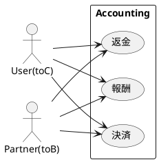
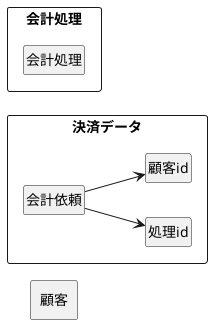

# Accounting Service

会計マイクロサービス
金銭のやり取りを追って帳簿につけていく。


### Usecase diagram


### Domain model diagram


## 会計処理データ

```json
{
  "data": [
    {
      "id": "61105CF1-A953-496E-9B65-B230DDC84D35", // サービス側のユニークな id
      "matter_id": "merpay-balance-add-funds", // イベントと会計処理の関係を定義する matter_id
      "service_id": "1", // どのマイクロサービスかを識別する service_id
      "amount": "900", // 会計処理の金額
      "date": "2018-07-18T12:14:07+0900", // イベントが発生した日時
      "vat_type": "5", // 消費税区分
      "client_dr_customer_id": "A001", // 借方に対応する取引先の id
      "client_dr_customer_type_id": "1", // 借方取引先 id の種別（お客さま or 加盟店さま）
      "client_cr_customer_id": "A003", // 貸方の取引先 id
      "client_cr_customer_type_id": "1", // 貸方取引先 id の種別
      "client_value": "xxxxx", // クライアント側が自由に内容を決める項目
      "option_value": "yyyyy" // 会計システム側が自由に内容を決める項目
    }
  ]
}
```

## Memo

- 整合性を保つReconcileAPIを用意

